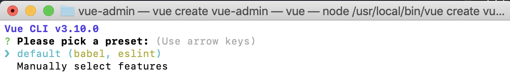
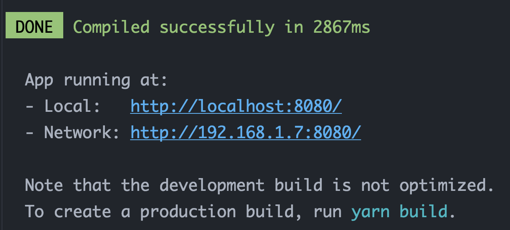
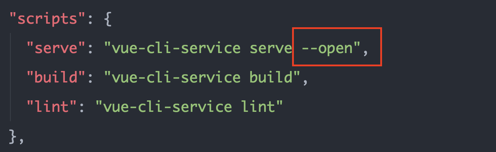
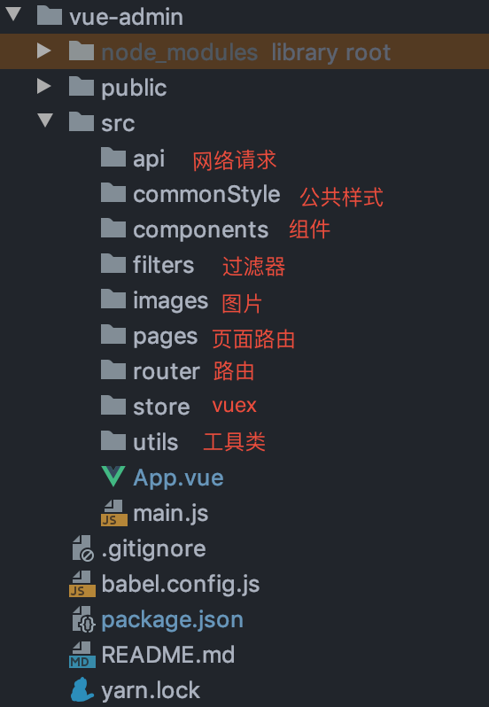

# 基于 vue 的PC项目
好久没写过 vue 的 pc 端项目了，这次我们来写一个这样的项目。

### 1. 项目描述
    (1). 此项目为基于 vue 的 PC 项目，类似于教务管理系统的
    (2). 包括账单、图表、搜索、用户等多个子模块
    (3). 使用vue 全家桶、element-ui 等技术
    (4). 采用模块化、组件化、工程化等模式开发

### 2. 项目截图
s

### 3. 项目搭建
#### 3.1 安装 vue cli 3.x 脚手架
vue cli 旧版本说明：

    若你在使用 vue cli 2.x 
    请先通过 `npm uninstall vue-cli -g` 
    或 `yarn global remove vue-cli` 卸载它。
    
Node 版本说明：

    vue cli 需要 Node.js 8.9 或更高版本 (推荐 8.11.0+)，
    若版本不对，请自行更新。

使用下面任意命令进行安装 vue cli 3.x ：
```
npm install -g @vue/cli
// 或 
yarn global add @vue/cli
```

#### 3.2 创建项目
使用 `vue create vue-admin` 创建项目，其中 vue-admin 是项目名称。

然后出现这个页面，选择 default，然后开始自动创建项目


项目创建完毕，使用以下命令进入项目根目录并启动项目
```
cd vue-admin
yarn serve
```
当看到下面界面则表示启动完毕


但是发现页面并没有自动打开，所以我们去配置一下`package.json`，找到`scripts`下的`serve`，
在最后添加` --open`，具体如下：


然后重新启动一下服务，发现页面自动打开了。
好，到现在项目创建完毕。

### 4. 项目目录
接下来就是对项目目录进行改造，如下：


### 5. 路由vue-router安装
在 vue 中是使用 vue-router 路由，所以先安装：`yarn add vue-router --save`。

在 router 文件夹下新建 index.js 文件
```javascript
import Vue from 'vue';
import VueRouter from 'vue-router'

Vue.use(VueRouter);

export default new VueRouter({
    routes: []
})

```
接着在 App.vue 中创建 router-view 标签
```vue
<template>
    <div id="app">
        <router-view/>
        app
    </div>
</template>
```
然后在main.js 中注册路由
```javascript
import router from './router'

new Vue({
  render: h => h(App),
  router,
}).$mount('#app')
```

### 6. vuex 安装及其配置
Vuex 是一个专为 Vue.js 应用程序开发的状态管理模式。它采用集中式存储管理应用的所有组件的状态，并以相应的规则保证状态以一种可预测的方式发生变化。
执行以下命令安装：
```
yarn add vuex
```
然后在 store 中创建`index.js`、`state.js`、`actions.js`、`getters.js`、`mutations.js` 和 `mutation-types.js`这几个文件。

```javascript
/**
 * state.js
 *
 * 状态对象
 */
export default {}
```

```javascript
/**
 * mutation-types.js
 *
 * 包含多个 mutation 的 type 名称的常量
 */
```

```javascript
/**
 * mutations.js
 *
 * 直接更新 state 的多个方法的对象
 */
import {} from './mutation-types'
export default {}
```

```javascript
/**
 * actions.js
 *
 * 通过 mutation 间接更新 state 对象
 */
import {} from './mutation-types'
export default {}
```

```javascript
/**
 * getters.js
 *
 * 包含多个基于 state 的 getter 计算属性的对象
 */
export default {}
```

```javascript
/**
 * index.js
 *
 * vuex最核心的管理对象
 */
import Vue from 'vue'
import Vuex from 'vuex'
import state from './state'
import mutations from './mutations'
import actions from './actions'
import getters from './getters'

Vue.use(Vuex)

export default new Vuex.Store({
  state,
  mutations,
  actions,
  getters
})
```
然后在 main.js 中注册 store，
```javascript
import store from './store'

new Vue({
  render: h => h(App),
  router,
  store
}).$mount('#app')
```

### 7. stylus 安装

在 vue cli 3.x 中只需安装 stylus-loader 和 stylus 插件就可以使用 stylus
```
yarn add stylus-loader stylus --save-dev
```
如果想使用 less 只需安装 less-loader 和 less 插件

### 8. 安装 element-ui
```
yarn add element-ui
```
css按需引入配置
先安装 babel-plugin-component 插件
```
yarn add babel-plugin-component --save-dev
```
打开`babel.config.js`,在最外层对象添加以下代码：
```
    "plugins": [
        [
            "component",
            {
                "libraryName": "element-ui",
                "styleLibraryName": "theme-chalk"
            }
        ]
    ]
```
组件完全引入
在 main.js 中添加如下代码：
```javascript
import ElementUI from 'element-ui';
Vue.use(ElementUI);
```

### 9. 编码
#### 9.1 登录注册界面

